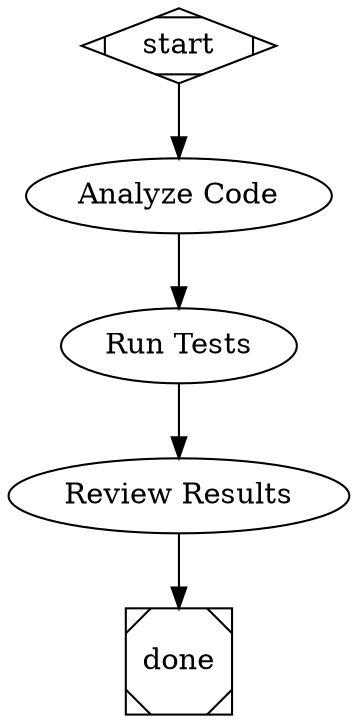

# Attractor

A DOT-based pipeline runner for AI workflows. Define multi-step agent pipelines as Graphviz digraphs, then run them with built-in tool use, multi-provider LLM support, and checkpoint/resume.

## Overview

Attractor lets you describe AI workflows as directed graphs using DOT syntax. Each node is a step (LLM call, tool use, human gate, parallel fan-out) and edges define the flow with optional conditions. The engine handles execution, edge selection, retries, goal enforcement, and cost tracking.



## Features

- **DOT pipeline definitions** -- Standard Graphviz digraph syntax with typed attributes (strings, integers, floats, booleans, durations)
- **Multi-provider LLM support** -- OpenAI, Anthropic, and Gemini adapters with unified request/response types
- **Built-in tools** -- read_file, write_file, edit_file, shell, grep, glob
- **Agent loop** -- LLM + tool execution cycle with steering injection, follow-up queues, loop detection, and output truncation
- **Pipeline engine** -- Graph traversal, edge selection, condition evaluation, parallel fan-out/fan-in, manager loops
- **Goal gates** -- Enforce completion criteria before allowing pipeline exit
- **Checkpoint/resume** -- Save and restore pipeline state mid-execution
- **Validation** -- 12 built-in lint rules for pipeline correctness
- **Stylesheets** -- CSS-like rules for applying attributes to nodes by selector
- **Variable transforms** -- Expand `${ctx.key}` references in node attributes
- **Retry with backoff** -- Configurable retry policies for node execution
- **Cost tracking** -- Per-node and total USD cost reporting

## Installation

```sh
cargo install --path crates/attractor-cli
```

Or build from source:

```sh
cargo build --release
```

## Usage

### Run a pipeline

```sh
attractor run pipeline.dot --workdir ./my-project
```

### Validate a pipeline

```sh
attractor validate pipeline.dot
```

### Inspect a pipeline

```sh
attractor info pipeline.dot
```

### Dry run (no LLM calls)

```sh
attractor run pipeline.dot --dry-run
```

## Environment Variables

Set API keys for the LLM providers you use:

```sh
export OPENAI_API_KEY=...
export ANTHROPIC_API_KEY=...
export GEMINI_API_KEY=...
```

## Crate Structure

| Crate | Description |
|-------|-------------|
| `attractor-types` | Shared error types and context |
| `attractor-dot` | DOT parser producing typed AST |
| `attractor-llm` | Unified LLM client (OpenAI, Anthropic, Gemini) |
| `attractor-tools` | Tool trait, registry, built-in tools, execution environment |
| `attractor-agent` | Agent session loop with steering and loop detection |
| `attractor-pipeline` | Pipeline graph, engine, handlers, validation, stylesheets |
| `attractor-cli` | CLI binary (`attractor run`, `validate`, `info`) |

## License

Licensed under either of

- Apache License, Version 2.0 ([LICENSE-APACHE](LICENSE-APACHE) or <http://www.apache.org/licenses/LICENSE-2.0>)
- MIT License ([LICENSE-MIT](LICENSE-MIT) or <http://opensource.org/licenses/MIT>)

at your option.

### Contribution

Unless you explicitly state otherwise, any contribution intentionally submitted for inclusion in the work by you, as defined in the Apache-2.0 license, shall be dual licensed as above, without any additional terms or conditions.
