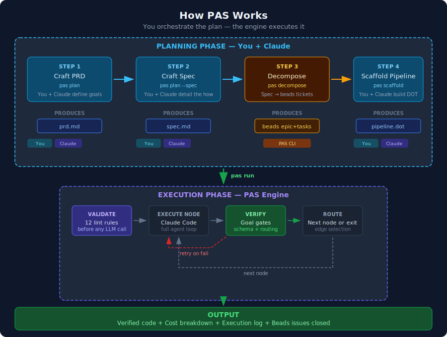
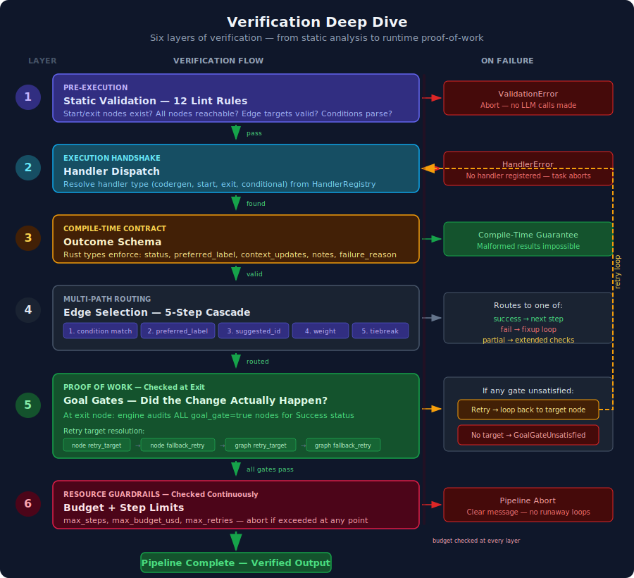
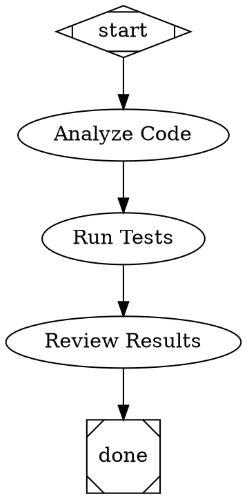

# Attractor

A DOT-based pipeline runner for AI workflows. Define multi-step agent pipelines as Graphviz digraphs, then run them with built-in tool use, multi-provider LLM support, and checkpoint/resume.

These loops don't just handle failure — they create iterative refinement. A pipeline can produce progressively better output across multiple passes without any single component knowing about "quality improvement." The retry system handles transient failures, context accumulation builds knowledge, and goal gates enforce standards. Together they produce convergent behavior toward a quality threshold that no individual loop implements.

<p align="center">
  
</p>

### How verification works

Attractor doesn't just run tasks — it verifies them. Six layers of checks ensure that every pipeline node actually did what it was supposed to do, from static analysis before any LLM call to runtime proof-of-work at the exit gate.

<p align="center">
  
</p>

1. **Static Validation** — 12 lint rules check pipeline structure before any LLM call. Missing start nodes, unreachable steps, and malformed conditions are caught immediately.
2. **Handler Dispatch** — The engine resolves each node's handler type (codergen, conditional, tool, etc.) and aborts if the handler isn't registered.
3. **Outcome Schema** — Rust's type system enforces the response contract at compile time. Every handler must return a status, context updates, and notes — malformed results are structurally impossible.
4. **Edge Routing** — A 5-step cascade selects the next edge: condition match → preferred label → suggested ID → weight → lexical tiebreak. This enables patterns like "pass → deploy, partial → extended tests, fail → fixup loop."
5. **Goal Gates** — The "proof of work" layer. Nodes marked `goal_gate=true` are audited at exit. If any gate is unsatisfied, the engine resolves a retry target (node → fallback → graph-level) and loops back. No target found means pipeline abort.
6. **Budget & Step Guards** — `max_steps`, `max_budget_usd`, and `max_retries` are enforced continuously. Runaway loops are impossible.

For the full specification including code references and examples, see **[docs/task-verification.md](docs/task-verification.md)**.

## Overview

Attractor lets you describe AI workflows as directed graphs using DOT syntax. Each node is a step (LLM call, tool use, human gate, parallel fan-out) and edges define the flow with optional conditions. The engine handles execution, edge selection, retries, goal enforcement, and cost tracking.



## Claude Code Integration

Attractor's default `codergen` handler executes pipeline nodes by shelling out to your local [Claude Code](https://docs.anthropic.com/en/docs/claude-code) installation (`claude` CLI). This means each node in your pipeline gets the full agentic capabilities of Claude Code — file editing, bash execution, multi-turn tool use — powered by your existing Claude subscription with no separate API keys required.

Under the hood, each `codergen` node runs:

```
claude -p "<prompt>" --output-format json
```

The handler parses Claude Code's JSON response to extract the result, cost, turn count, and success/failure status, then feeds that context forward to downstream nodes.

### Node attributes for Claude Code nodes

| Attribute | Description |
|-----------|-------------|
| `prompt` (required) | The task prompt sent to Claude Code |
| `llm_model` | Model override (e.g. `"sonnet"`, `"haiku"`, `"opus"`) |
| `allowed_tools` | Comma-separated list of tools Claude Code may use |
| `max_budget_usd` | Spending cap for this node |

Conditional nodes (`shape=diamond`) automatically instruct Claude Code to select an outgoing edge label, enabling LLM-driven branching.

For nodes that only need a single LLM completion without tool use, Attractor also provides direct API handlers for OpenAI, Anthropic, and Gemini via the `attractor-llm` crate.

## Features

- **Claude Code as execution engine** -- Pipeline nodes run via your local `claude` CLI, getting full agentic tool use with no extra API keys
- **DOT pipeline definitions** -- Standard Graphviz digraph syntax with typed attributes (strings, integers, floats, booleans, durations)
- **Planning workflow** -- Generate PRD and spec documents from templates or AI prompts, decompose specs into beads issues, scaffold pipelines from epics
- **Beads integration** -- Decompose specs into epics and tasks, scaffold pipelines from beads epics, close issues as pipeline nodes complete
- **Multi-provider LLM support** -- OpenAI, Anthropic, and Gemini adapters with unified request/response types
- **Built-in tools** -- read_file, write_file, edit_file, shell, grep, glob
- **Agent loop** -- LLM + tool execution cycle with steering injection, follow-up queues, loop detection, and output truncation
- **Pipeline engine** -- Graph traversal, edge selection, condition evaluation, parallel fan-out/fan-in, manager loops
- **Human review gates** -- Pause pipeline execution for human approval at any step
- **Goal gates** -- Enforce completion criteria before allowing pipeline exit
- **Checkpoint/resume** -- Save and restore pipeline state mid-execution
- **Validation** -- 12 built-in lint rules for pipeline correctness
- **Stylesheets** -- CSS-like rules for applying attributes to nodes by selector
- **Variable transforms** -- Expand `${ctx.key}` references in node attributes
- **Retry with backoff** -- Configurable retry policies for node execution
- **Cost tracking** -- Per-node and total USD cost reporting

## Installation

```sh
cargo install --path crates/attractor-cli
```

Or build from source:

```sh
cargo build --release
```

## Usage

### Run a pipeline

```sh
attractor run pipeline.dot --workdir ./my-project
```

### Validate a pipeline

```sh
attractor validate pipeline.dot
```

### Inspect a pipeline

```sh
attractor info pipeline.dot
```

### Dry run (no LLM calls)

```sh
attractor run pipeline.dot --dry-run
```

### Planning workflow (PRD → Spec → Beads → Pipeline)

```sh
# Generate a PRD from a prompt
attractor plan --prd --from-prompt "Add user authentication with OAuth2"

# Or copy the blank template and edit manually
attractor plan --spec

# Decompose a spec into beads epic + tasks
attractor decompose .attractor/spec.md

# Scaffold a pipeline from the beads epic
attractor scaffold <EPIC_ID>

# Run the generated pipeline
attractor run pipelines/<EPIC_ID>.dot -w .
```

There's also a meta-pipeline that chains the full workflow end-to-end:

```sh
attractor run templates/plan-to-execute.dot -w .
```

## Documentation

- **[docs/cli-reference.md](docs/cli-reference.md)** — CLI commands, flags, examples, and environment setup
- **[docs/task-verification.md](docs/task-verification.md)** — How pipeline nodes are verified: handler dispatch, outcome schemas, goal gates, edge routing, and budget guards
- **[docs/guide.md](docs/guide.md)** — Full user guide covering:

- DOT file syntax and all node/edge attributes
- Conditional routing, goal gates, and stylesheets
- Pipeline patterns (linear, verify/fixup loop, branching, feature implementation)
- Planning workflow (PRD → spec → beads → pipeline)
- Beads integration for issue-driven development
- Writing effective prompts and controlling costs
- Adding Attractor to your project

## Environment Variables

The default `codergen` handler uses your local Claude Code installation and requires no API keys — it runs on your Claude subscription.

For direct API calls via the `attractor-llm` crate (OpenAI, Anthropic, or Gemini handlers), set the relevant keys:

```sh
export OPENAI_API_KEY=...
export ANTHROPIC_API_KEY=...
export GEMINI_API_KEY=...
```

## Crate Structure

| Crate | Description |
|-------|-------------|
| `attractor-types` | Shared error types and context |
| `attractor-dot` | DOT parser producing typed AST |
| `attractor-llm` | Unified LLM client (OpenAI, Anthropic, Gemini) |
| `attractor-tools` | Tool trait, registry, built-in tools, execution environment |
| `attractor-agent` | Agent session loop with steering and loop detection |
| `attractor-pipeline` | Pipeline graph, engine, handlers, validation, stylesheets |
| `attractor-cli` | CLI binary (`attractor run`, `validate`, `info`, `plan`, `decompose`, `scaffold`) |

## License

Licensed under either of

- Apache License, Version 2.0 ([LICENSE-APACHE](LICENSE-APACHE) or <http://www.apache.org/licenses/LICENSE-2.0>)
- MIT License ([LICENSE-MIT](LICENSE-MIT) or <http://opensource.org/licenses/MIT>)

at your option.

### Contribution

Unless you explicitly state otherwise, any contribution intentionally submitted for inclusion in the work by you, as defined in the Apache-2.0 license, shall be dual licensed as above, without any additional terms or conditions.
