# Accept & Execute — C4 Diagrams

## Level 1: System Context

```mermaid
flowchart TB
    user["👤 Developer"]

    web["Attractor Web<br/><i>Leptos WASM + Axum SSR</i>"]
    cli["Attractor CLI<br/><i>decompose & scaffold</i>"]
    fs[("Filesystem<br/><i>specs, pipelines, issues</i>")]

    user -- "Approve & Execute" --> web
    web -- "SSE progress stream" --> user
    web -- "child process" --> cli
    web -- "read/write" --> fs
    cli -- "write .dot" --> fs

    style user fill:#08427b,color:#fff,stroke:#08427b
    style web fill:#1168bd,color:#fff,stroke:#1168bd
    style cli fill:#999,color:#fff,stroke:#999
    style fs fill:#999,color:#fff,stroke:#999
```

## Level 2: Container

### Container Legend

| Container | Technology | Responsibility |
|-----------|-----------|----------------|
| Browser Client | Leptos WASM, xterm.js | Renders UI, dispatches server fns, subscribes to SSE |
| Axum Server | Rust, Leptos SSR | Handles server fns, spawns CLI processes, streams events |
| Broadcast Channels | tokio::broadcast | Session-keyed event bus with 100-event replay buffer |
| Attractor CLI | Rust binary | `decompose` specs into epics, `scaffold` pipeline .dot files |
| Filesystem | Local disk | `.attractor/spec.md`, `pipelines/*.dot`, beads issues |

## Level 3: Component

### Component Legend

| Component | File | Responsibility |
|-----------|------|----------------|
| ApprovalBar | `components/approval_bar.rs` | Button, dispatches `start_execution()`, shows phase spinner |
| ExecutionPanel | `components/execution_panel.rs` | Subscribes to SSE, renders node list with live status |
| ExecutionNode | `components/execution_node.rs` | Single node: status badge, cost, notes |
| start_execution() | `server/execute.rs` | Orchestrates decompose, scaffold, parse, spawn |
| attractor_cli_path() | `server/execute.rs` | Resolves CLI binary from `ATTRACTOR_CLI_PATH` env var |
| PipelineRunner | `server/execute.rs` | Walks graph, executes handlers, publishes events |
| stream_events() | `server/stream.rs` | SSE endpoint, bridges broadcast to EventSource |
| publish_event() | `server/stream.rs` | Writes to broadcast channel + replay buffer |
| SESSION_STATE | `server/stream.rs` | Last 100 events per session for reconnect replay |

## Sequence Diagram

