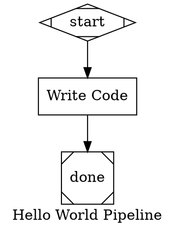
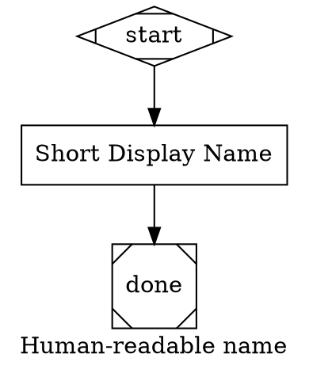
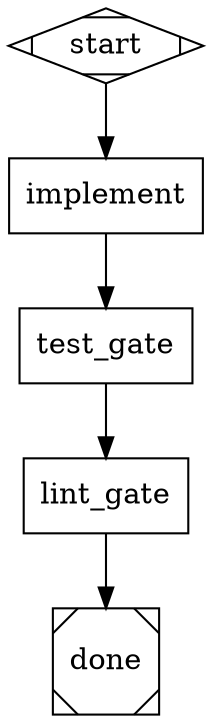
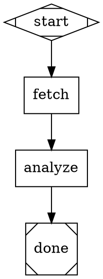
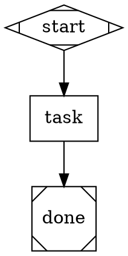
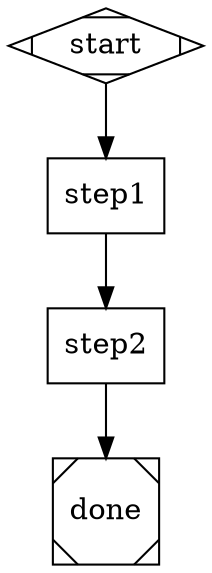
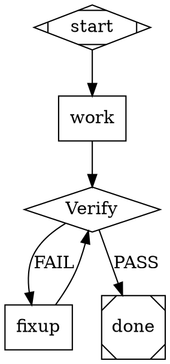
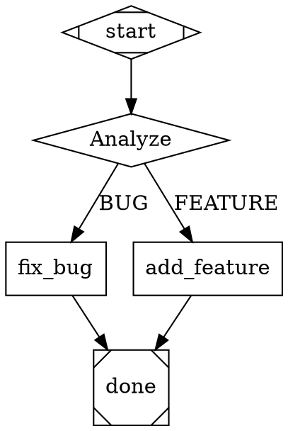
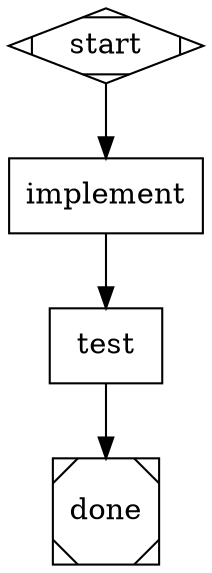
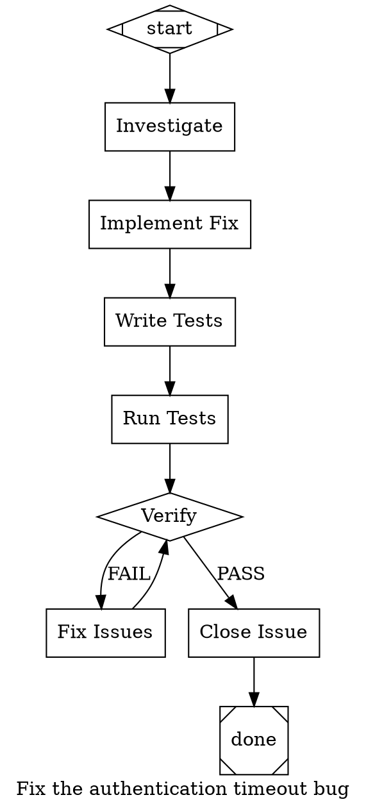

# Attractor User Guide

Attractor is a pipeline runner for AI workflows. You define pipelines as DOT (Graphviz) digraphs. Each node becomes a Claude Code session that runs your prompt. The engine handles traversal, branching, retries, quality gates, and cost tracking.

## Table of Contents

- [Quick Start](#quick-start)
- [DOT File Anatomy](#dot-file-anatomy)
- [Nodes](#nodes)
- [Edges](#edges)
- [Conditional Routing](#conditional-routing)
- [Goal Gates](#goal-gates)
- [Stylesheets](#stylesheets)
- [Variable Expansion](#variable-expansion)
- [Validation Rules](#validation-rules)
- [Edge Selection Algorithm](#edge-selection-algorithm)
- [Pipeline Patterns](#pipeline-patterns)
- [Planning Workflow](#planning-workflow)
- [Integrating with Beads](#integrating-with-beads)
- [Adding to Your Project](#adding-to-your-project)
- [Writing Effective Prompts](#writing-effective-prompts)
- [Cost Control](#cost-control)
- [Troubleshooting](#troubleshooting)

---

## CLI Reference

For full CLI documentation with all flags, examples, and environment setup, see **[cli-reference.md](cli-reference.md)**.

---

## Quick Start

### Build

```bash
cd /path/to/attractor
cargo build --release
```

The binary is at `target/release/attractor-cli`.

### Create a pipeline

Create `hello.dot`:



### Run it

```bash
attractor-cli run hello.dot -w /path/to/your/project
```

### Other commands

```bash
attractor-cli validate hello.dot   # Check for errors without running
attractor-cli info hello.dot       # Show structure (nodes, edges, goal)
attractor-cli plan --prd           # Generate a PRD template
attractor-cli plan --spec          # Generate a spec template
attractor-cli decompose spec.md   # Decompose spec into beads tasks
attractor-cli scaffold <EPIC_ID>   # Scaffold pipeline from beads epic
```

---

## DOT File Anatomy

Every pipeline is a `digraph` with graph-level attributes, node definitions, and edges.



### Graph attributes

| Attribute | Purpose |
|-----------|---------|
| `label` | Pipeline display name |
| `goal` | Objective description — injected into every node's context |
| `model` | Default LLM model for all nodes (e.g. `"sonnet"`, `"haiku"`, `"opus"`) |
| `retry_target` | Global fallback retry target for goal gates |
| `fallback_retry_target` | Second-level global fallback |
| `stylesheet` | Inline CSS-like rules (see [Stylesheets](#stylesheets)) |

---

## Nodes

### Node shapes

| Shape | Role | Handler |
|-------|------|---------|
| `Mdiamond` | **Start node.** Entry point. Exactly one required. | StartHandler (instant) |
| `Msquare` | **Exit node.** Pipeline completion. Exactly one required. | ExitHandler (instant) |
| `box` | **Task node.** Runs Claude Code with the `prompt`. | CodergenHandler |
| `diamond` | **Conditional node.** Claude's response picks the outgoing edge. | ConditionalHandler + CodergenHandler |
| `hexagon` | **Human gate.** Pauses for human input/approval. | WaitHumanHandler |
| `parallelogram` | **Tool node.** Runs a shell command. | ToolHandler |

### Node attributes

| Attribute | Type | Default | Description |
|-----------|------|---------|-------------|
| `label` | string | node ID | Display name shown in logs |
| `prompt` | string | — | **The task sent to Claude Code.** Required for `box` and `diamond` nodes. |
| `node_type` | string | auto | Explicit handler type override (`"conditional"`, `"tool"`, `"parallel"`, `"fan_in"`, `"manager"`) |
| `llm_model` | string | graph `model` | Model override for this node (`"haiku"`, `"sonnet"`, `"opus"`, or full model ID) |
| `allowed_tools` | string | all | Comma-separated Claude Code tool list (`"Read,Grep,Glob"` for read-only) |
| `max_budget_usd` | string | unlimited | Maximum spend for this node's Claude Code session |
| `goal_gate` | boolean | false | If true, this node must succeed for the pipeline to complete |
| `retry_target` | string | — | Node ID to loop back to if this goal gate fails |
| `fallback_retry_target` | string | — | Second-level retry target |
| `max_retries` | integer | 0 | Maximum retry attempts for this node |
| `timeout` | duration | — | Max execution time (e.g. `"5m"`, `"1h30m"`) |
| `fidelity` | string | — | Context fidelity mode: `"full"`, `"truncate"`, `"compact"`, `"summary"` |
| `classes` | string | — | Space-separated class list for stylesheet matching |
| `tool_command` | string | — | Shell command for `parallelogram` (tool) nodes |
| `auto_status` | boolean | true | Automatically set status from outcome |
| `allow_partial` | boolean | false | Allow partial success |

### Tool nodes (parallelogram)

Tool nodes run a shell command instead of Claude Code:

```dot
run_tests [
    shape="parallelogram"
    label="Run Tests"
    tool_command="cd mlb_fantasy_jobs && uv run pytest tests/ -x -v"
]
```

The `tool_command` attribute is required for parallelogram nodes.

---

## Edges

Edges define the flow between nodes. Basic syntax:

```dot
nodeA -> nodeB                           // Unconditional
nodeA -> nodeB [label="Success"]         // Labeled
nodeA -> nodeB [condition="outcome=success"]  // Conditional
nodeA -> nodeB [weight=10]               // Weighted (higher = preferred)
```

### Edge attributes

| Attribute | Type | Default | Description |
|-----------|------|---------|-------------|
| `label` | string | — | Display label (also used for preferred_label matching) |
| `condition` | string | — | Condition expression that must be true for this edge |
| `weight` | integer | 0 | Higher weight = preferred when multiple edges match |
| `loop_restart` | boolean | false | If true, clears completed nodes and outcomes (for loops) |
| `fidelity` | string | — | Override fidelity when traversing this edge |

### Chained edges

DOT supports edge chains:

```dot
start -> investigate -> implement -> test -> done
```

This creates edges: `start→investigate`, `investigate→implement`, `implement→test`, `test→done`.

---

## Conditional Routing

Conditional nodes let Claude's response determine which path the pipeline takes.

### Setup

1. Make the node a `diamond` shape (or set `node_type="conditional"`)
2. Add outgoing edges with `label` and `condition` attributes
3. Write the prompt so Claude outputs one of the labels

```dot
review [
    shape="diamond"
    label="Review Changes"
    prompt="Review the code changes. Check for bugs, style issues, and test coverage.
If everything looks good, respond with PASS on the last line.
If there are problems, respond with FAIL on the last line."
]

review -> deploy  [label="PASS", condition="preferred_label=PASS"]
review -> fixup   [label="FAIL", condition="preferred_label=FAIL"]
```

### How it works

1. Claude Code runs the prompt
2. The handler scans Claude's response for one of the edge labels
3. It checks the last 5 lines for an exact match (case-insensitive)
4. Falls back to scanning the full response
5. Sets `preferred_label` on the outcome
6. The edge selection engine matches `condition="preferred_label=PASS"` and routes accordingly

### Condition syntax

Conditions use a simple expression language:

```
key=value                    // Equality
key!=value                   // Inequality
key=value && key2=value2     // AND (multiple clauses)
outcome=success              // Check the node's outcome status
preferred_label=BUY          // Check the extracted label
```

Available context keys in conditions:
- `outcome` — the node's status: `success`, `fail`, `partial_success`, `retry`, `skipped`
- `preferred_label` — the label extracted from Claude's response

---

## Goal Gates

Goal gates enforce quality requirements before the pipeline can exit. If a goal gate node fails, the pipeline either retries or errors out.

### Basic usage

```dot
final_review [
    shape="box"
    label="Final Review"
    prompt="Verify all acceptance criteria are met."
    goal_gate=true
    retry_target="implement"
]
```

If `final_review` fails:
1. The pipeline loops back to `implement` and re-executes from there
2. On the second pass, if `final_review` succeeds, the pipeline exits normally

### Retry target resolution (4-level fallback)

When a goal gate fails, the retry target is resolved in this order:

1. **Node `retry_target`** — the node's own attribute
2. **Node `fallback_retry_target`** — the node's fallback
3. **Graph `retry_target`** — the graph-level default
4. **Graph `fallback_retry_target`** — the graph-level fallback

If no retry target is found at any level, the pipeline returns a `GoalGateUnsatisfied` error.

### Multiple goal gates

You can have multiple goal gate nodes. All are checked when the pipeline reaches the exit node. If any fail, the first failed gate's retry target is used.



---

## Stylesheets

CSS-like rules for applying attributes to nodes by selector. Useful for setting models across groups of nodes without repeating yourself.

### Syntax

Stylesheets can be set as a graph attribute or applied programmatically:

```dot
digraph Pipeline {
    stylesheet="
        * { llm_model: haiku; }
        .critical { llm_model: opus; }
        #final_review { llm_model: opus; reasoning_effort: high; }
    "
    // ...nodes...
}
```

### Selectors

| Selector | Specificity | Matches |
|----------|-------------|---------|
| `*` | 0 | Every node |
| `.classname` | 1 | Nodes with `classes="classname"` |
| `#node_id` | 2 | Node with matching ID |

Higher specificity wins. Explicit node attributes always override stylesheet values.

### Supported properties

| Property | Maps to |
|----------|---------|
| `llm_model` | `llm_model` node attribute |
| `llm_provider` | `llm_provider` node attribute |
| `reasoning_effort` | `reasoning_effort` node attribute |

### Example with classes



Here `fetch` uses haiku (from `*`), `analyze` uses sonnet (from `.analysis`).

---

## Variable Expansion

Node prompts can reference context values using `${ctx.key}` syntax. Variables are expanded before the prompt is sent to Claude Code.



Graph attributes are available as `${ctx.attribute_name}`. Context values set by prior nodes (e.g. `node_id.result`) are also available.

---

## Validation Rules

Run `attractor-cli validate pipeline.dot` to check your pipeline. The validator runs 11 lint rules:

| Rule | Severity | What it checks |
|------|----------|----------------|
| StartNodeRule | Error | Exactly one `Mdiamond` node exists |
| TerminalNodeRule | Error | At least one `Msquare` node exists |
| ReachabilityRule | Error | All nodes are reachable from start |
| EdgeTargetExistsRule | Error | All edge targets reference existing nodes |
| StartNoIncomingRule | Error | Start node has no incoming edges |
| ExitNoOutgoingRule | Error | Exit node has no outgoing edges |
| ConditionSyntaxRule | Error | All condition expressions parse correctly |
| FidelityValidRule | Warning | Fidelity values are one of: full, truncate, compact, summary |
| RetryTargetExistsRule | Warning | Retry targets reference existing nodes |
| GoalGateHasRetryRule | Warning | Goal gate nodes have a retry target defined |
| PromptOnLlmNodesRule | Warning | Box/diamond nodes have a `prompt` attribute |

Errors prevent execution. Warnings are reported but don't block.

---

## Edge Selection Algorithm

When a node completes, the engine selects the next edge using a 5-step priority cascade:

1. **Condition match** — Edges with a `condition` that evaluates to true. If multiple match, highest weight wins, then lexical order.
2. **Preferred label** — Edge whose `label` matches the outcome's `preferred_label` (case-insensitive, strips `&` accelerators).
3. **Suggested next ID** — Edge whose target matches one of the outcome's `suggested_next_ids`.
4. **Highest weight** — Edge with the highest `weight` value.
5. **Lexical tiebreak** — First edge by alphabetical target node ID.

If no edge matches and the node's status is `Fail`, the pipeline errors. Otherwise it terminates normally.

---

## Pipeline Patterns

### Linear pipeline

The simplest pattern — sequential steps:



### Verify/fixup loop

The most common pattern for real work. A conditional node checks quality and loops back on failure:

```
start → work → verify ──PASS──→ done
                  └──FAIL──→ fixup ─→ verify
```



### Branching pipeline

Route to different paths based on analysis:



### Goal gate with retry

Enforce that critical nodes succeed before the pipeline completes:



If `test` fails, the pipeline loops back to `implement` and tries again. On the second pass, the pipeline reaches `done` and checks all goal gates — if `test` succeeded this time, it exits.

### Feature implementation (full pattern)

The recommended pattern for implementing features or fixing bugs:



---

## Planning Workflow

Attractor includes a full planning-to-execution workflow that bridges structured documents to beads issue tracking to pipeline execution.

### The flow

```
write PRD → review → write spec → review → decompose → scaffold → validate → execute
```

The **PRD** captures *what and why* (goals, user stories, requirements). The **spec** captures *how* (architecture, file changes, implementation phases). The spec's phases become beads issues, which become an attractor pipeline.

### Step 1: Generate documents

```bash
# Generate a PRD from a one-line description
attractor plan --prd --from-prompt "Add real-time notifications via WebSockets"

# Or copy the blank template for manual editing
attractor plan --prd
attractor plan --spec
```

Templates are in `templates/prd-template.md` and `templates/spec-template.md`. The PRD template includes sections for overview, goals, user stories, functional requirements, constraints, risks, and success criteria. The spec template includes architecture overview, file changes, implementation phases, configuration, testing strategy, and rollback plan.

### Step 2: Decompose spec into beads issues

```bash
# Preview the beads commands that would be created
attractor decompose .attractor/spec.md --dry-run

# Create the epic and tasks
attractor decompose .attractor/spec.md
```

This reads the spec's `## Implementation Phases` section and creates:
- A beads epic for the overall feature
- Child tasks for each phase/task
- Dependencies between tasks based on phase ordering

### Step 3: Scaffold and run the pipeline

```bash
# Generate a pipeline from the beads epic
attractor scaffold <EPIC_ID>

# Validate it
attractor validate pipelines/<EPIC_ID>.dot

# Run it
attractor run pipelines/<EPIC_ID>.dot -w .
```

The scaffold command uses the `epic-runner` template, which loops through all child tasks of the epic: pick task → investigate → implement → test → verify → close → next task.

### Meta-pipeline (fully automated)

There's a meta-pipeline at `templates/plan-to-execute.dot` that chains the full workflow with human review gates:

```bash
attractor run templates/plan-to-execute.dot -w .
```

This pipeline:
1. Generates a PRD → pauses for human review
2. Generates a spec → pauses for human review
3. Decomposes the spec into beads tasks
4. Scaffolds a pipeline from the epic
5. Validates the pipeline
6. Executes the pipeline

Human review gates use `hexagon` nodes (WaitHumanHandler). You approve or reject at each gate; rejection loops back to regenerate.

### Human review gates

Use `hexagon` nodes to pause for human input:

```dot
review [
    shape="hexagon"
    label="Review Changes"
    prompt="Review the PRD at .attractor/prd.md.
Respond 'continue' to proceed or 'reject' to regenerate."
]

review -> next_step [label="continue"]
review -> regenerate [label="reject", condition="preferred_label=reject"]
```

---

## Integrating with Beads

Attractor pipelines work well with [beads](https://github.com/Dicklesworthstone/beads_viewer) for issue tracking.

### Workflow

1. **Find work:** `bd ready` shows issues with no blockers
2. **Review:** `bd show <issue-id>` to get full context
3. **Create pipeline:** Write a `.dot` file referencing the issue in the `goal`, or use `attractor scaffold <epic-id>`
4. **Run:** `attractor-cli run pipelines/fix-issue.dot -w .`
5. **The pipeline closes the issue** in its final node

### Referencing issues

Put the issue ID in the `goal` so every node has context:

```dot
goal="Fix baseball-v3-vfd5: sync_player_data silently returns partial results as success"
```

### Processing an entire epic

Use `scaffold` to generate a pipeline that iterates through all tasks in a beads epic:

```bash
# Create pipeline from epic
attractor scaffold my-epic-id

# Run it — loops through all child tasks automatically
attractor run pipelines/my-epic-id.dot -w .
```

The generated pipeline follows this loop for each task:
```
pick_task → investigate → implement → run_tests → verify → close_task → check_remaining → pick_task (loop)
```

See `templates/epic-runner.dot` for the full template.

### Closing issues in the pipeline

The final node before `done` should commit and close:

```dot
close_issue [
    shape="box"
    label="Close Issue"
    allowed_tools="Bash(bd:*),Bash(git:*)"
    prompt="Stage changes: git add -A
Commit: git commit -m 'fix: descriptive message (baseball-v3-vfd5)'
Close: bd close baseball-v3-vfd5 --reason='Fixed the issue'
Sync: bd sync --flush-only"
]
```

The `allowed_tools="Bash(bd:*),Bash(git:*)"` restricts this node to only run beads and git commands.

### Full planning-to-execution workflow

For a complete workflow from requirements to running code, see [Planning Workflow](#planning-workflow). The `plan`, `decompose`, and `scaffold` commands chain together:

```bash
attractor plan --spec --from-prompt "Add feature X"   # Generate spec
attractor decompose .attractor/spec.md                 # Create beads tasks
attractor scaffold <EPIC_ID>                           # Generate pipeline
attractor run pipelines/<EPIC_ID>.dot -w .             # Execute
```

---

## Adding to Your Project

### 1. Create a pipelines directory

```bash
mkdir pipelines
echo "*.dot" >> .gitignore  # Optional: exclude pipeline files from git
```

### 2. Add instructions to AGENTS.md

Copy the template from `templates/attractor.md` in the Attractor repo and append it to your project's `AGENTS.md` or `CLAUDE.md`. This teaches Claude Code how to create and run pipelines when you ask it to.

After adding the template, you can say things like:

- "Build a pipeline for issue baseball-v3-vfd5"
- "Create a pipeline to add authentication to the API"
- "Use a pipeline to refactor the notification service"

Claude Code will read the instructions, look up the issue, and generate a `.dot` file.

### 3. Set up an alias

```bash
# In your shell profile
alias attractor='/path/to/attractor/target/release/attractor-cli'
```

Then run pipelines with:

```bash
attractor run pipelines/my-feature.dot -w .
```

### 4. Add .attractor to .gitignore

Pipeline nodes write intermediate files to `.attractor/`:

```bash
echo ".attractor/" >> .gitignore
```

---

## Writing Effective Prompts

Each node's `prompt` is the entire context Claude Code receives. It has no memory of prior conversation — it's a fresh `-p` (print mode) session.

### Do

- **Be specific about file paths.** `"Edit mlb_fantasy_jobs/app/tasks/processors.py"` not `"Edit the processor file"`.
- **Include exact commands.** `"Run: cd mlb_fantasy_jobs && uv run pytest tests/ -x -v -k sync"` not `"Run the tests"`.
- **One concern per node.** Investigation, implementation, and testing should be separate nodes.
- **Tell Claude to write output.** `"Write your findings to .attractor/analysis.md"` — otherwise the response vanishes when the node completes.
- **Reference the goal.** The pipeline `goal` is injected automatically, but reinforcing key details in the prompt helps.

### Don't

- **Don't combine investigation and implementation.** Read-only first, then edit.
- **Don't assume context.** Each node is a fresh Claude Code session. Pass information via files (`.attractor/`) or context keys.
- **Don't leave prompts vague.** `"Fix the bug"` gives Claude nothing to work with. Include the file, function, and expected behavior.

### Context flow between nodes

Each node's result is stored as `{node_id}.result` in the pipeline context and injected into subsequent nodes' prompts under "Context from prior pipeline steps." For large outputs, prefer writing to files:

```dot
investigate [prompt="...Write findings to .attractor/findings.md"]
implement  [prompt="Read .attractor/findings.md for context, then..."]
```

---

## Cost Control

### Per-node budgets

```dot
cheap_task [shape="box", max_budget_usd="0.50", prompt="Simple task"]
```

### Model selection

Use cheaper models for simple tasks:

```dot
fetch_data [shape="box", llm_model="haiku", prompt="Fetch and format data"]
analyze    [shape="box", llm_model="sonnet", prompt="Deep analysis"]
review     [shape="box", llm_model="opus", prompt="Critical review"]
```

### Restrict tools for read-only nodes

Nodes that only need to read code run faster and cheaper:

```dot
investigate [shape="box", allowed_tools="Read,Grep,Glob", prompt="Analyze the codebase"]
```

### Cost reporting

The CLI prints total cost at the end:

```
Pipeline completed
Completed nodes: ["start", "investigate", "implement", "test", "done"]
Total cost: $1.6934
```

Per-node costs are stored in context as `{node_id}.cost_usd`.

---

## Troubleshooting

### "No start node found"

Your pipeline is missing a node with `shape="Mdiamond"`.

### "Claude CLI exited with..."

The `claude` binary isn't in your PATH, or it returned a non-zero exit code. Check:
- `which claude` returns a path
- `claude -p "hello" --output-format json` works standalone

### Node always takes the same branch

The conditional handler scans Claude's response for edge labels. If Claude doesn't output the label clearly, the first edge wins. Fix by being explicit in the prompt:

```
You MUST end your response with exactly one of: PASS, FAIL
```

### Pipeline exits without running all nodes

The engine follows one edge at a time. If a node has multiple outgoing edges without conditions, only one is followed (by weight, then lexical order). Use conditions on edges to control routing.

### Goal gate loops forever

If a goal gate node keeps failing and retrying, the pipeline will loop indefinitely. Add `max_retries` to cap attempts, or make the retry target different from the original path so the second attempt has better chances.

### Intermediate results are lost

Node outputs are in-memory. If you need to persist them:
1. Tell the node to write files: `"Write your analysis to .attractor/report.md"`
2. The CLI prints total cost but not individual node results (check `.attractor/` for written files)
