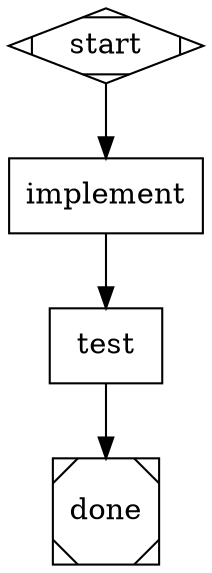

# Task Verification in Attractor

How Attractor verifies that pipeline nodes (agent tasks) actually completed — and completed correctly. Verification is layered, moving from basic execution checks to deep logic validation.

---

## 1. Execution Handshake (Handler Dispatch)

The first layer is **transport-level**. When the pipeline engine dispatches a task to a handler, it expects a well-formed `Outcome` response.

- **Handler Resolution:** The engine resolves the handler type for each node (`codergen`, `start`, `exit`, `conditional`) and looks it up in the `HandlerRegistry`. If no handler is registered, execution fails immediately with a `HandlerError`.
- **Timeout / Budget Guards:** The engine enforces `max_steps` and `max_budget_usd` limits. If a node hangs or the pipeline enters a runaway loop, it aborts with a clear error rather than running forever.
- **Failure on No Response:** If a handler returns `StageStatus::Fail` and there is no outgoing edge to handle the failure, the pipeline terminates with a `HandlerError`.

**Relevant code:** `crates/attractor-pipeline/src/engine.rs` — the main execution loop (Phase 4).

---

## 2. Output Schema (Outcome Structure)

Every handler must return an `Outcome` struct. The type system enforces the contract at compile time:

| Field | Type | Purpose |
|-------|------|---------|
| `status` | `StageStatus` | `Success`, `Fail`, `PartialSuccess`, `Retry`, `Skipped` |
| `preferred_label` | `Option<String>` | Hint for edge selection (conditional routing) |
| `suggested_next_ids` | `Vec<String>` | Ordered preference for next node |
| `context_updates` | `HashMap<String, Value>` | Key-value pairs merged into pipeline context |
| `notes` | `String` | Human-readable summary of what happened |
| `failure_reason` | `Option<String>` | Explanation when status is `Fail` |

- **Structure enforcement:** Rust's type system guarantees every handler returns all required fields. There is no "malformed result" at runtime — the compiler catches it.
- **Data integrity:** Context updates use `serde_json::Value`, so type mismatches (e.g., string where a number is expected) surface when downstream nodes consume them via typed accessors.
- **Status propagation:** The engine writes `outcome` to the pipeline context after each node, making the result available to edge conditions.

**Relevant code:** `crates/attractor-types/src/lib.rs` — `Outcome` and `StageStatus` definitions.

---

## 3. Functional Logic Verification (Goal Gates)

This is the "proof of work" layer. The pipeline doesn't just trust that a node succeeded — goal gates enforce that **the intended change actually happened**.

### How it works

1. Mark critical nodes with `goal_gate=true` in the DOT definition.
2. When the pipeline reaches the exit node (`shape="Msquare"`), the engine checks **all** goal gate nodes.
3. If any goal gate node's outcome is not `Success`, the pipeline either retries or fails.

### Retry resolution order

When a goal gate fails, the engine looks for a retry target in this order:

1. **Node `retry_target`** — the failing node's own attribute
2. **Node `fallback_retry_target`** — the node's fallback
3. **Graph `retry_target`** — graph-level default
4. **Graph `fallback_retry_target`** — graph-level fallback
5. **No target found** → `GoalGateUnsatisfied` error (pipeline aborts)

### Example



If `test` fails, the pipeline loops back to `implement`. On the next pass, `implement` gets the failure context and can fix the code. The cycle continues until tests pass or `max_retries` / `max_steps` is hit.

**Relevant code:** `crates/attractor-pipeline/src/goal_gate.rs` — `enforce_goal_gates()`.

---

## 4. Conditional Edge Routing (Multi-Path Validation)

Instead of binary pass/fail, Attractor supports **condition-based routing** that lets the pipeline take different verification paths based on node outcomes or context values.

### Edge conditions

```dot
check -> fix_path   [condition="outcome=fail"]
check -> next_step  [condition="outcome=success"]
check -> review     [condition="outcome=partial_success"]
```

Conditions can reference:
- `outcome` — the node's execution status
- `preferred_label` — the node's suggested edge label
- Any key in the pipeline context (e.g., `deploy_env=prod`)

### Edge selection algorithm

1. Check edges with matching conditions first
2. Fall back to `preferred_label` match
3. Fall back to `suggested_next_ids` from the handler
4. Fall back to `default=true` edge
5. Fall back to the single unconditional edge (if only one exists)

This enables verification patterns like "if tests pass, deploy; if tests partially pass, run extended tests; if tests fail, loop back to fix."

**Relevant code:** `crates/attractor-pipeline/src/edge_selection.rs` — `select_edge()`.

---

## 5. State Observation (Context & Checkpoint)

The pipeline maintains a shared `Context` (an async key-value store) that serves as the state observer.

### Status progression

As each node executes, the context tracks the full pipeline state:

- **Before execution:** Node is the `current_node` in the engine loop
- **After execution:** `Outcome` recorded in `node_outcomes` map, context updates applied
- **At exit:** `enforce_goal_gates()` audits all gate nodes before allowing completion

### Checkpoint/resume

Pipeline state can be serialized mid-execution and restored later, enabling:
- Long-running pipelines that survive process restarts
- Human review gates that pause for approval
- Debugging failed pipelines from the point of failure

### Cost tracking

Each node's `cost_usd` context update is accumulated. The engine logs per-node and running totals, and aborts if the budget is exceeded.

**Relevant code:** `crates/attractor-types/src/lib.rs` — `Context` implementation.

---

## 6. Static Validation (Lint Rules)

Before any execution begins, the pipeline is validated against 12 built-in lint rules:

| Rule | Severity | What it checks |
|------|----------|----------------|
| Start/exit node presence | Error | Pipeline has exactly one start and at least one exit |
| Reachability | Error | All nodes are reachable from start |
| Edge targets exist | Error | No edges pointing to undefined nodes |
| Condition syntax | Error | Edge conditions are well-formed |
| Goal gate has retry | Warning | Goal gate nodes have a retry target defined |
| Prompt presence | Warning | Execution nodes have a prompt attribute |
| Fidelity values | Warning | Context fidelity attributes use valid prefixes |
| Orphan detection | Warning | No disconnected subgraphs |

Validation runs as Phase 2 of the 5-phase lifecycle (parse → **validate** → initialize → execute → finalize). Errors abort before any LLM calls are made.

**Relevant code:** `crates/attractor-pipeline/src/validation.rs` — `validate()` and `validate_or_raise()`.

---

## Summary: Verification Layers

| Layer | What is Checked | Failure Result |
|-------|----------------|----------------|
| **Static Validation** | Pipeline structure correct? | `ValidationError` before execution |
| **Handler Dispatch** | Handler exists and responds? | `HandlerError`, task abort |
| **Outcome Schema** | Output has required fields? | Compile-time error (Rust types) |
| **Edge Routing** | Status matches a route? | Pipeline terminates or errors |
| **Goal Gates** | Did the intended change happen? | Retry loop or `GoalGateUnsatisfied` |
| **Budget/Step Guards** | Within resource limits? | Pipeline abort with clear message |
