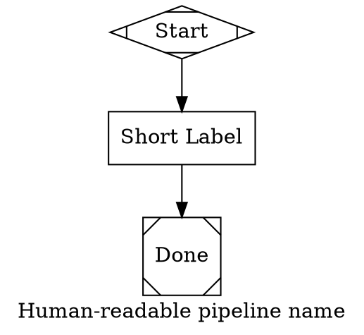

---

## Attractor Pipeline System

This project uses **Attractor** — a DOT-based pipeline runner that executes multi-step AI workflows. Each pipeline is a `.dot` file where nodes are Claude Code sessions. Pipelines live in `pipelines/`.

### Running a pipeline

```bash
# Binary location (build once, use everywhere)
ATTRACTOR="/Volumes/qwiizlab/projects/attractor/target/debug/attractor-cli"

# Validate before running
$ATTRACTOR validate pipelines/my-pipeline.dot

# Run with working directory set to this repo
$ATTRACTOR run pipelines/my-pipeline.dot -w .

# Inspect structure
$ATTRACTOR info pipelines/my-pipeline.dot
```

### Creating a pipeline

When asked to "build a pipeline" or "use a pipeline for this feature/bug", create a `.dot` file in `pipelines/`. Follow this structure:



### Node attributes

| Attribute | Purpose | Example |
|-----------|---------|---------|
| `prompt` | The task sent to Claude Code (required for box nodes) | `prompt="Fix the bug in auth.py"` |
| `llm_model` | Override model per node | `llm_model="haiku"` |
| `allowed_tools` | Restrict tools (read-only, git-only, etc.) | `allowed_tools="Read,Grep,Glob"` |
| `max_budget_usd` | Spending cap for this node | `max_budget_usd="1.00"` |
| `goal_gate` | Node must succeed for pipeline to complete | `goal_gate=true` |
| `retry_target` | Where to loop back on goal gate failure | `retry_target="implement"` |

### Node shapes

| Shape | Meaning |
|-------|---------|
| `Mdiamond` | Start node (exactly one) |
| `Msquare` | Exit node (exactly one) |
| `box` | Standard task — runs Claude Code with the prompt |
| `diamond` | Conditional — Claude's response picks the outgoing edge |

### Edge routing (conditional nodes)

For diamond-shaped nodes, give outgoing edges `label` and `condition` attributes. Claude is asked to output one of the labels, which routes the pipeline:

```dot
verify [shape="diamond", label="Check Quality", node_type="conditional",
        prompt="Review the changes. Respond PASS or FAIL on the last line."]

verify -> next_step [label="PASS", condition="preferred_label=PASS"]
verify -> fix_step  [label="FAIL", condition="preferred_label=FAIL"]
```

### Standard pipeline pattern for features/bugs

Follow this 6-phase pattern when building pipelines for beads issues:

```
start → investigate → implement → write_tests → run_tests → verify
                                                                ├─ PASS → close_issue → done
                                                                └─ FAIL → fixup ──→ verify (loop)
```

1. **investigate** — Read-only. `allowed_tools="Read,Grep,Glob"`. Understand the code before touching it. Write findings to `.attractor/`.
2. **implement** — Make the code changes. Keep the prompt specific with file paths and exact requirements.
3. **write_tests** — Write tests matching existing project patterns. Reference specific test directories.
4. **run_tests** — Execute tests. Prompt should include the exact test command (e.g. `uv run pytest tests/ -k sync`).
5. **verify** — Conditional diamond. Run linter + review changes. Output PASS or FAIL.
6. **fixup** — Only reached on FAIL. Fix issues and loop back to verify.
7. **close_issue** — Commit, close beads issue, sync. Use `allowed_tools="Bash(bd:*),Bash(git:*)"`.

### Key rules for prompts

- **Be specific.** Include file paths, function names, and exact commands. Claude Code in `-p` mode has no prior context.
- **One concern per node.** Don't combine investigation and implementation.
- **Write output files.** If a node generates a report or analysis, tell it to write to `.attractor/filename.md`.
- **Reference the beads issue** in the `goal=` attribute so every node has context.
- **Use read-only tools for investigation.** `allowed_tools="Read,Grep,Glob"` prevents premature edits.
- **Include test commands.** Don't say "run tests" — say `cd mlb_fantasy_jobs && uv run pytest tests/ -x -v -k sync_player`.

### Example

See `pipelines/fix-sync-partial-failure.dot` for a complete pipeline that fixes beads issue `baseball-v3-vfd5`.

---